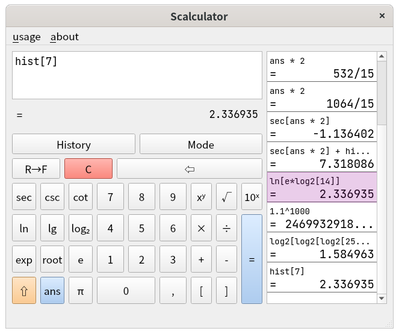

# Scalculator

Simple yet full-fledged calculator, with [Sevaluator](https://github.com/fpg2012/sevaluator) as backend.



Big number is supported.

# INSTALL
mkdir build && cd build;
cmake .. && make;

## For ArchLinux

Scalculator is availible on AUR

```
git clone https://aur.archlinux.org/scalculator.git
cd scalculator
makepkg -si
```
or use a AUR helper (e.g. yay)

```
yay -S scalculator
```

# make packages

cd build;
cpack;
